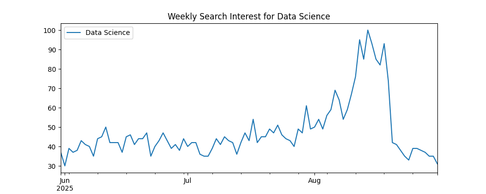

# 📊 Google Search Analysis using Pytrends

A Python project that leverages the **Pytrends API** to analyze Google search trends for technology topics such as **Cloud Computing, Artificial Intelligence, Machine Learning, Data Science, and Blockchain**.  
It provides insights into **interest over time, regional popularity, related queries, keyword comparisons, and long-term search patterns** with interactive and static visualizations.


## 🚀 Features
- 📈 Interest Over Time for selected keywords  
- 🗓️ Historical and custom period analysis  
- 🌍 Interest by Region (Top 10 countries)  
- 🔥 Related queries and keyword suggestions  
- ⚖️ Keyword comparison (e.g., AI vs ML)  
- 📅 Weekly and seasonal patterns  
- 📊 Long-term popularity trends (5 years)  
- 🔗 Correlation analysis between keywords  


## 📂 Project Structure

- `Google_SearchAnalysis.py` → Main Python script  
- `README.md` → Project documentation  
- `last5.png` → Blockchain popularity (5 years)  
- `searchinterest.png` → Weekly Data Science trend  
- `AI vs ML.png` → AI vs ML comparison  
- `IBYREGION.png` → Interest by Region (Cloud Computing)  
- `IOT.png` → Interest Over Time (Cloud Computing)  
- `GDA.pdf` → Console output sample  


## 🛠️ Installation
Make sure you have Python 3.x installed. Then install the required libraries.

## ▶️ Usage

Clone the repository and run the script:
```bash
git clone https://github.com/your-username/Google-Search-Analysis.git
cd Google-Search-Analysis
python Google_SearchAnalysis.py
```

The script will fetch Google Trends data and generate insights with both **console outputs** and **visual charts**.


## 📊 Sample Outputs

### 🔹 Interest Over Time (Cloud Computing)


### 🔹 Interest by Region (Cloud Computing)


### 🔹 AI vs ML Popularity


### 🔹 Weekly Search Interest (Data Science)


### 🔹 Blockchain Popularity (5 Years)


📑 **Full console outputs are available here:**  
➡️ [View GDA.pdf](GDA.pdf)


## 💡 Future Enhancements

* Automate daily/weekly updates
* Add forecasting using Prophet for trend prediction
* Build an interactive dashboard using Plotly Dash or Streamlit


## 👩‍💻 Author

**Megha Rajeev**
🎓 B.Tech in Information Technology | 📊 Data Analyst Aspirant


